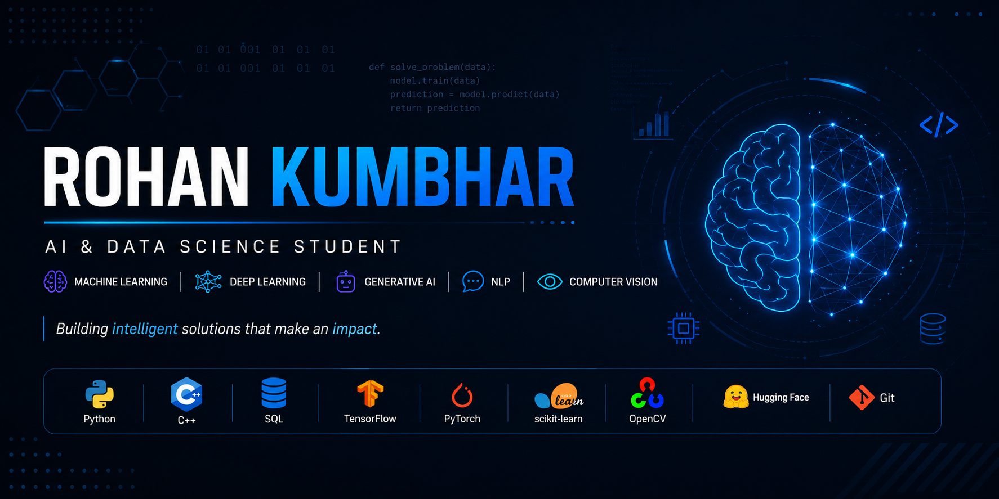

````md
<p align="center">
  
</p>

<h1 align="center">Rohan Kumbhar</h1>

<h3 align="center">
AI & Data Science Student 🚀 | Machine Learning 🧠 | Deep Learning 🤖 | Generative AI ✨
</h3>

<p align="center">
  <a href="mailto:your-email@gmail.com">
    
  </a>

  <a href="https://leetcode.com/u/Rohan_Kumbhar_4640/">
    
  </a>

  
</p>

---

# 👨‍💻 About Me

```yaml
name: Rohan Kumbhar

role: AI & Data Science Student

location: Pune, India

focus:
  - Machine Learning
  - Deep Learning
  - Generative AI
  - NLP
  - Computer Vision
  - Data Structures & Algorithms

currently_learning:
  - LangChain
  - RAG
  - LLM Applications
  - Advanced DSA

motto:
  - Learn • Build • Improve
````

---

# 🛠️ Tech Stack

## 💻 Languages

<p align="center">

</p>

---

## 🤖 AI / ML

<p align="center">

</p>

<p align="center">
Machine Learning • Deep Learning • NLP • Computer Vision • Generative AI
</p>

---

## ⚙️ Tools

<p align="center">

</p>

---

# 🚀 Featured Projects

### ⚖️ NyayaMitra

AI-powered Legal Assistance Platform using NLP and Generative AI.

### 🔍 Surface Defect Detection

Computer Vision system for automated defect detection and quality inspection.

### 🖼️ Image Tampering Detection

Deep Learning based image forgery and manipulation detection system.

### 🧠 Mental Health NLP Assistant

NLP-powered mental health analysis and sentiment classification project.

---

# 📊 GitHub Stats

<p align="center">
  
</p>

<p align="center">
  
</p>

<p align="center">
  
</p>

---

# 🧩 LeetCode

<p align="center">
  <a href="https://leetcode.com/u/Rohan_Kumbhar_4640/">
    
  </a>
</p>

---

# 🎯 Current Goals

* Master DSA & Competitive Programming
* Build End-to-End AI Applications
* Learn Advanced LLMs & RAG Systems
* Contribute to Open Source
* Secure AI/ML & GenAI Opportunities

---

<h3 align="center">
🚀 Building intelligent solutions that make an impact.
</h3>
```
